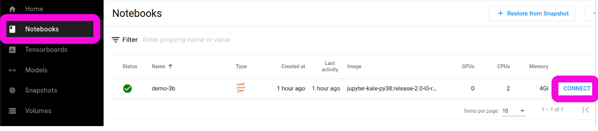
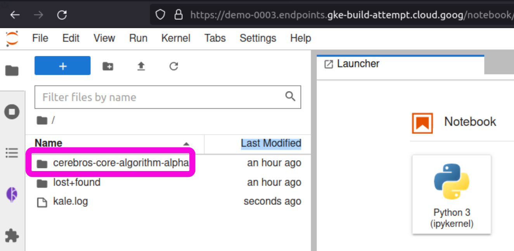
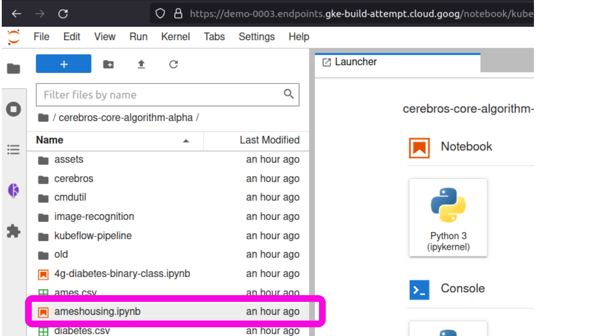
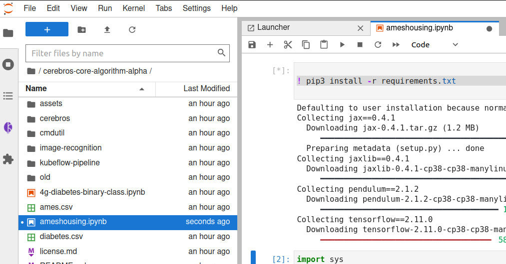
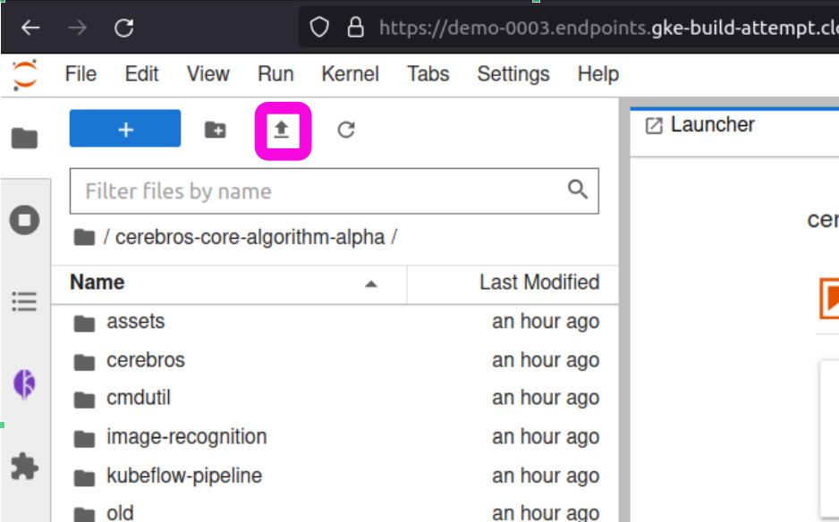
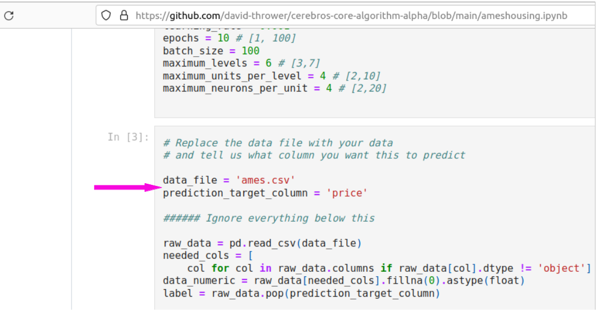
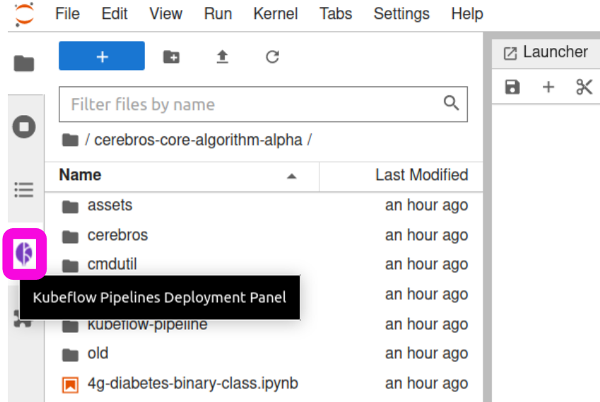
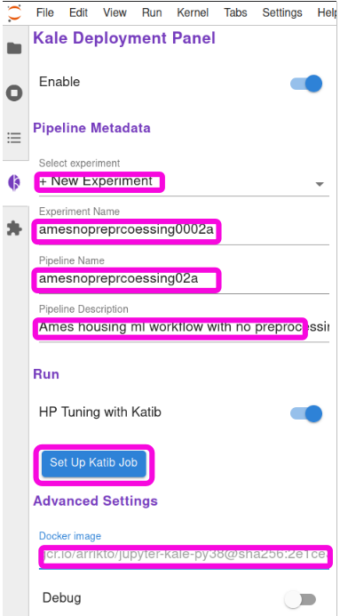
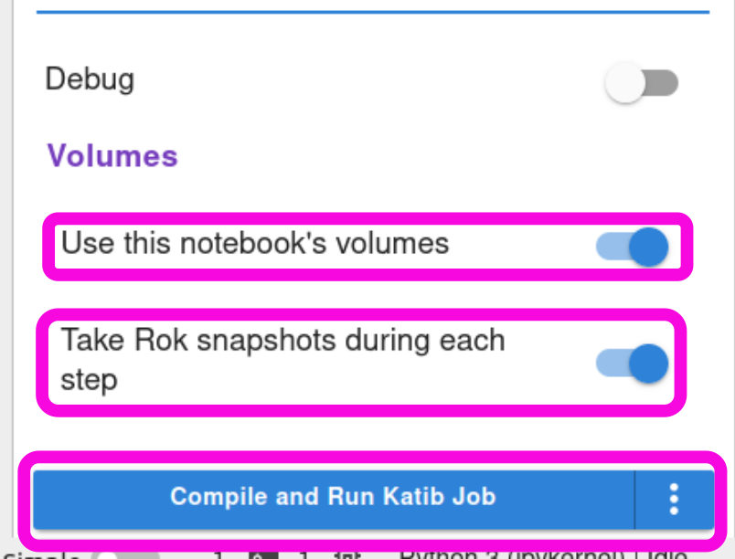

# cerebros-enterprise-public

## Cerebros Enterprise: An enterprise deployment of the open source Cerebros AutoML Platform:

1. Cerebros is an open source AutoML that provides state of the art ML model performance from small and noisy datasets.
2. Cerebros is a user friendly app that enables anyone who can upload a file tro a web page, tell it what file it is running, and what column it is trying to predict, to build state of the art ML models from their own data.
3. This can be used for so may valuable things:
  1. Predicting which leads are going to buy and hence which ones to prioritize pitching advertising to.
  2. Predicting sale prices.
  3. Predicting customer churn. ...

## Documentation

How to use Cerebros

1. Log in at the url provided when you signed up, use the user name and password provided:

2. Click [Notebooks] > [Connect].

3. Open the Cerebros folder:

4. Open the Ames housing demo:

5. Run the first cell [shift] + [enter].

6. Run the second cell. **WAIT FOR THIS TO POP UP and click [OK].

7. Upload your data:

8. Tell Cerebros which file you want it to train your AI model with, and tell it which column in the file you want it to predict. This file should be in CSV format. There are additional options for ingesting other formats of files like tab delimited, JSON, parquet, or connecting to databases. Tor this, look at the documentation for the Pandas Python package.

9. Click the Kale leaf button.

10. Setup Kale (Most of these settings should be set for you, but verify them.)
    1. New experiment
    2. Give your experiment a name
    3. Give a name for the pipeline (should be anything that makes it obvious which experiment it is for).
    5. Make sure the "Docker image" field is blank. If it isn't, delete whatever is there. If you don't, the pipeline will fail out.
    6. Last, Click setup Katib job.
    
    7. Click [advanced settings].
    
