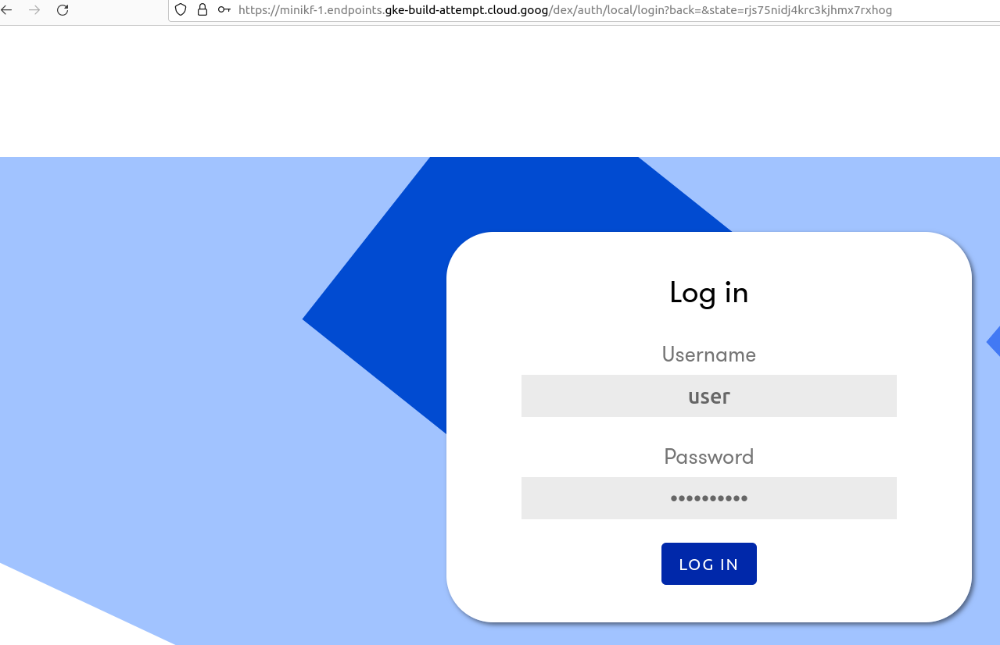

# cerebros-enterprise-public

## Cerebros Enterprise: An enterprise deployment of the open source Cerebros AutoML Platform:

1. Cerebros is an open source AutoML that provides state of the art ML model performance from small and noisy datasets.
2. Cerebros is a user friendly app that enables anyone who can upload a file tro a web page, tell it what file it is running, and what column it is trying to predict, to build state of the art ML models from their own data.
3. This can be used for so may valuable things:
  1. Predicting which leads are going to buy and hence which ones to prioritize pitching advertising to.
  2. Predicting sale prices.
  3. Predicting customer churn. ...

## Documentation

How to use Cerebros

1. Log in at the url provided when you signed up, use the user name and password provided:

2. Click [Notebooks] > [Connect].

